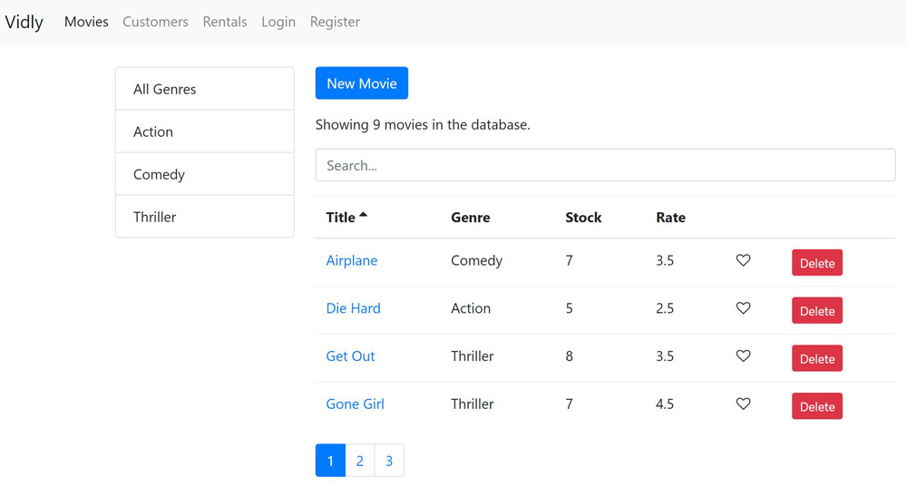

# Movie rentals

This project was build as a practice project of an online course [Mastering React](https://codewithmosh.com/p/mastering-react).

This simple one page app displays a table of movies available to rent. A delete button allows delete a corresponding movie. A paragraph on th top displays information with number of movies available for rent.

My goal with the project was to keep coding, strengthen my understanding of how React works, become fast and more efficient with React.

## How to run

1. Clone or download the repository.
2. Run `npm install` to install the project dependencies.
3. Run the app using `npm start`.
4. The app will launch in your browser at the address [http://localhost:3000/](http://localhost:3000/).

## Dependencies

1. Bootstrap

## Credits

- [Mastering React Course](https://codewithmosh.com/p/mastering-react)

This project was bootstrapped with [Create React App](https://github.com/facebookincubator/create-react-app).
